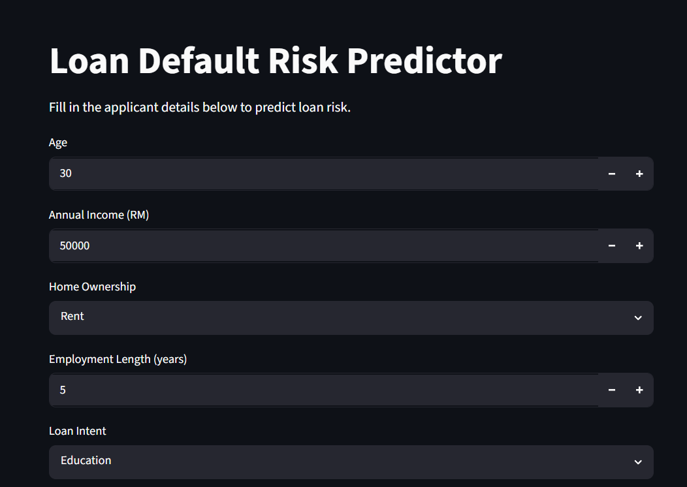
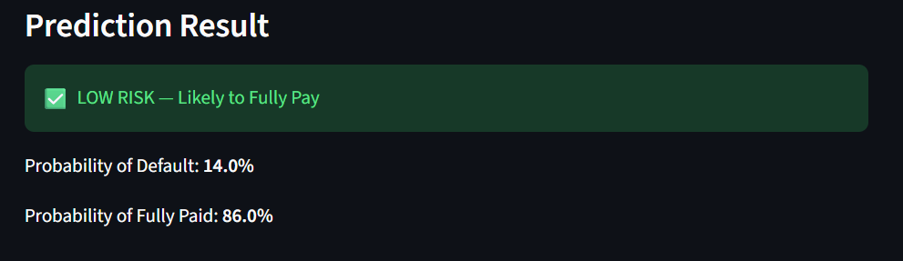
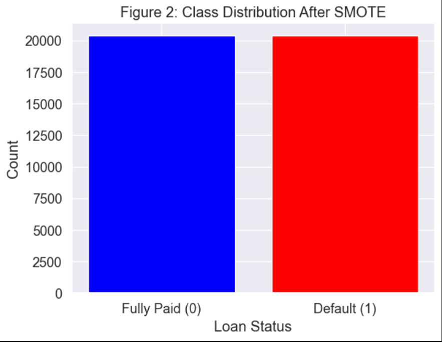
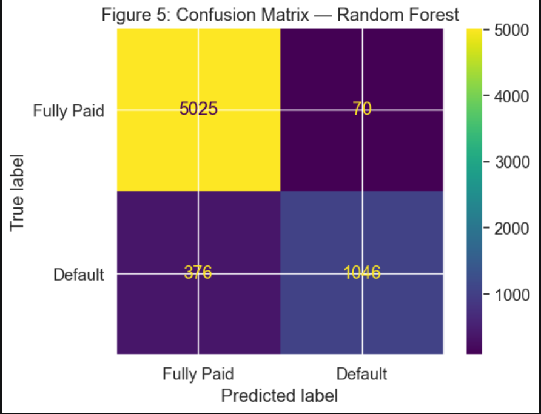
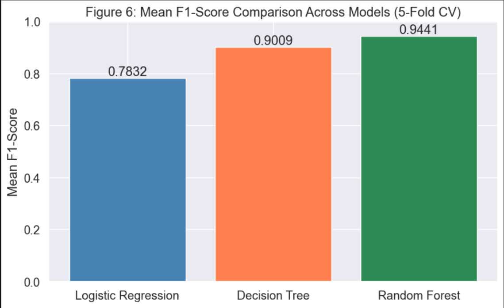

# 🏦 Loan Default Risk Predictor

A machine learning web application that predicts whether a loan applicant is likely to **default** or **fully repay** their loan, built with Python, scikit-learn, and Streamlit.

---

## 📌 Project Overview

Loan lenders face significant financial risk when borrowers fail to repay. This project builds a binary classification system to identify high-risk applicants **before** loan approval, helping minimize losses.

- **Target:** `loan_status` — `0` = Fully Paid, `1` = Default
- **Goal:** Maximize recall for Class 1 (defaults) while maintaining reasonable precision
- **Decision Rule:** High predicted risk → Reject | Low predicted risk → Approve

---

## 🖥️ App Screenshot







---

## 📁 Project Structure

```
├── LoanPrediction.ipynb   # Full ML pipeline (EDA, preprocessing, training, evaluation)
├── app.py                 # Streamlit web app
├── rf_model.pkl           # Saved Random Forest model
├── scaler.pkl             # Saved StandardScaler (must match training)
├── cr_loan2.csv           # Dataset
└── README.md
```

---

## 🔄 ML Pipeline

### Phase 1 — Data Preprocessing
- Loaded `cr_loan2.csv` from [Kaggle](https://www.kaggle.com/datasets/sananmammadov/credit-loan)
- Dropped columns with >50% missing values
- Imputed numerical columns with **median** (robust to skewed income/age data)
- Imputed categorical columns with **most frequent** value
- Label-encoded categorical features:

| Feature | Encoding |
|---|---|
| `person_home_ownership` | RENT=0, MORTGAGE=1, OWN=2, OTHER=3 |
| `loan_intent` | EDUCATION=0, MEDICAL=1, VENTURE=2, PERSONAL=3, DEBTCONSOLIDATION=4, HOMEIMPROVEMENT=5 |
| `loan_grade` | A=0, B=1, C=2, D=3, E=4, F=5, G=6 |
| `cb_person_default_on_file` | N=0, Y=1 |

- Applied **StandardScaler** on training data, then scaled test data with the same fitted scaler
- Applied **SMOTE** on training data only to handle class imbalance (defaults are rare in real life. The test set is intentionally left imbalanced)

### Phase 2 — Model Training (5-Fold Stratified CV)

Three models were trained and compared:

| Model | Accuracy | Precision | Recall | F1-Score |
|---|---|---|---|---|
| Logistic Regression | — | — | — | — |
| Decision Tree | — | — | — | — |
| **Random Forest** ✅ | — | — | — | — |

> Fill in your actual cross-validation scores from the notebook output.

**Random Forest** was selected as the final model due to its highest overall performance and best recall on the default class.

### Phase 3 — Deployment
The trained `rf_model.pkl` and `scaler.pkl` are loaded into a Streamlit app for real-time prediction.

---

## 🚀 Getting Started

### Prerequisites

```bash
pip install pandas numpy scikit-learn imbalanced-learn streamlit
```

### Run the App

```bash
streamlit run app.py
```

Open your browser at `http://localhost:8501`.

---

## 🧾 Input Features

| Feature | Description |
|---|---|
| Age | Applicant's age (18–100) |
| Annual Income (RM) | Gross yearly income |
| Home Ownership | RENT / MORTGAGE / OWN / OTHER |
| Employment Length | Years employed |
| Loan Intent | Purpose of the loan |
| Loan Grade | Credit grade assigned (A–G) |
| Loan Amount (RM) | Requested loan size |
| Interest Rate (%) | Loan interest rate |
| Loan as % of Income | Loan amount ÷ annual income |
| Previous Default on Record | Whether applicant has defaulted before |
| Credit History Length | Years of credit history |

---

## 📊 Output

- ✅ **LOW RISK** — Applicant is likely to fully repay
- ⚠️ **HIGH RISK** — Applicant is likely to default

Along with the probability score for each outcome.

---

## 📦 Dataset

- Source: [Credit Loan Dataset — Kaggle](https://www.kaggle.com/datasets/sananmammadov/credit-loan)
- File: `cr_loan2.csv`

---

## 🛠️ Tech Stack

- **Python**
- **scikit-learn** — ML models, preprocessing, cross-validation
- **imbalanced-learn** — SMOTE oversampling
- **pandas / numpy** — data manipulation
- **matplotlib / seaborn** — visualizations
- **Streamlit** — web app deployment
- **pickle** — model serialization
